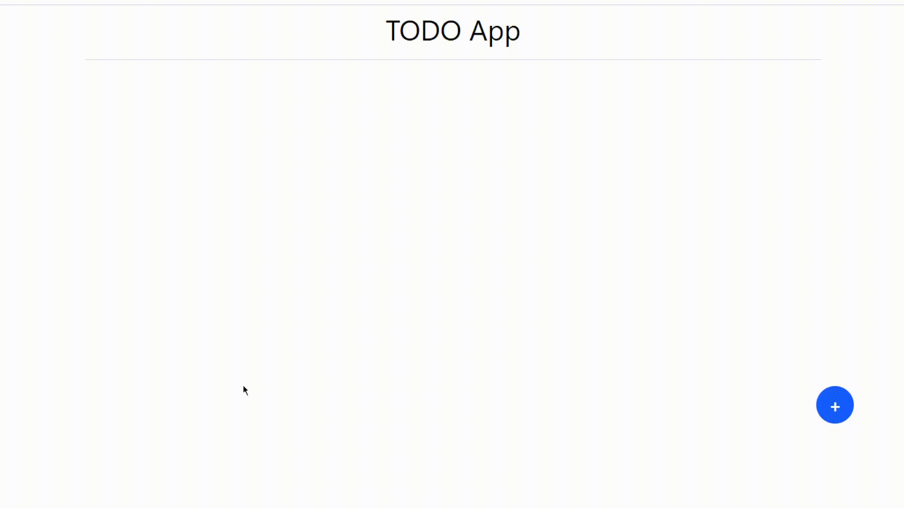

# To-Do App React

Минималистичное приложение для ведения списка задач, реализованное на React. Это простой и лаконичный проект, идеально подходящий для изучения основ React — работы с состоянием, JSX, взаимодействия с локальным хранилищем и т.д.

---



## ​ Описание

- Удобный интерфейс для добавления, удаления и отметки задач как выполненных.
- Задачи сохраняются в `localStorage`, так что они сохраняются между сессиями.
- Строгая простота и минимализм дизайна.

---

## Функции

- **Добавление задач** — ввод названия и описания, создание новой задачи.
- **Удаление задач** — удаление ненужных элементов.
- **Редактирование задач** - редактирование, исправление названиия задачи
- **Отметка выполнения** — переключение статуса задачи.
- **Сохранение в браузере** — данные сохраняются между перезагрузками благодаря `localStorage`.

---

## Технологии

- `React` — UI и управление состоянием.
- `localStorage` — для долговременного хранения задач на клиенте.

---

## Установка и запуск

1. Клонируй репозиторий:
   ```bash
   git clone https://github.com/silius124/to-do-app-react.git
   cd to-do-app-react
   ```
2. Установи зависимости:
   ```bash
   npm install
   ```
   или
   ```bash
   yarn
   ```
3. Запусти проект:
   ```bash
   npm start
   ```
   или
   ```bash
   yarn start
   ```
4. Открой приложение в браузере: [http://localhost:3000](https://silius124.github.io/to-do-app-react/)

---

## Как это работает

- **Состояние задач** хранится в React (через `useState`)
- При каждом изменении список задач обновляется в `localStorage`.
- При перезагрузке страницы приложение загружает задачи из `localStorage`.

---

## Предложения по улучшению (Roadmap)

- Фильтрация задач: отображение всех / только активных / только выполненных.
- Поддержка drag-and-drop для упорядочивания списка.
- Синхронизация с сервером или реализация backend (например, через REST API).
- Темная/светлая тема (Light & Dark mode).

---

## Цель проекта

Этот репозиторий — отличный старт для начинающих фронтенд-разработчиков. Здесь можно тренироваться и расширять функционал: подключить аутентификацию, real-time обновления, интеграцию с базой данных — и многое другое.

---

## Лицензия

MIT — свободное использование на твоё усмотрение.
